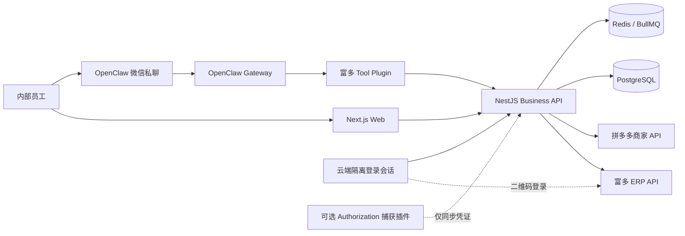

# 富多店铺智能助手：云端直连开发方案 V1.0

## 文档索引

- 本文：总体架构、技术栈、阶段计划和验收范围。
- [UI_UX_DESIGN_PLAN.md](./UI_UX_DESIGN_PLAN.md)：信息架构、视觉系统、页面和交互状态。
- [UI_REDESIGN_PROJECT_PLAN.md](./UI_REDESIGN_PROJECT_PLAN.md)：参考 UI 的纯视觉重构范围、实施阶段和验收标准。
- [PROJECT_DESIGN_LOGIC.md](./PROJECT_DESIGN_LOGIC.md)：业务域、状态机、数据流、Agent 和同步逻辑。

## 1. 已确认需求

- 使用范围：公司内部使用，单租户。
- 初始规模：1 名用户、1 个富多账号、10 家以内店铺。
- 部署形态：业务系统和接口请求全部运行在云服务器。
- 数据请求：云服务器直接请求富多 ERP API；不让 Windows 电脑代发销售查询。
- 首期权限：只读，不做发货、改价、商品修改、广告调整等写操作。
- 数据能力：长期保存销售、订单、退款等历史数据。
- 对话渠道：Web Chat + 腾讯微信团队维护的 OpenClaw 微信私聊插件。
- 模型能力：后台可配置和切换多个模型供应商。
- 部署限制：服务器和域名后续确定，不以中国大陆备案为前提。

## 2. 总体结论

采用“云端业务平台 + OpenClaw 对话网关 + 富多工具插件”的模块化架构。所有业务查询在云端完成。富多授权优先在网站中通过企业微信二维码完成；Windows 端授权捕获插件作为自动上报兜底，不参与销售、订单或退款请求。



## 3. 技术栈

### 3.1 Monorepo

- Node.js 22 LTS
- TypeScript strict mode
- pnpm workspace
- Turborepo

### 3.2 Web

- Next.js App Router
- React
- Tailwind CSS
- shadcn/ui
- TanStack Query
- ECharts

### 3.3 云端 API

- NestJS
- Fastify adapter
- Zod：外部 API 响应运行时校验
- Prisma：数据库访问和迁移
- Pino：结构化日志，敏感字段自动脱敏

### 3.4 数据和任务

- PostgreSQL：业务主库和历史指标
- Redis：缓存、分布式锁、临时会话
- BullMQ：定时同步、日报、周报、重试任务

### 3.5 Agent 和渠道

- OpenClaw Gateway
- `@tencent-weixin/openclaw-weixin`：微信私聊
- 自定义 `openclaw-fuduo` Tool Plugin
- 模型供应商适配层：OpenAI-compatible、Anthropic、DeepSeek、通义千问等

## 4. 推荐项目结构

```text
fuduo-cloud-assistant/
├─ apps/
│  ├─ web/                     # Next.js 网站
│  ├─ api/                     # NestJS API
│  └─ worker/                  # BullMQ Worker
├─ packages/
│  ├─ database/                # Prisma Schema 和 migrations
│  ├─ shared/                  # DTO、错误码、通用类型
│  ├─ fuduo-sdk/               # 富多 ERP API 客户端
│  ├─ pdd-sdk/                 # 拼多多 API 客户端
│  ├─ credential-vault/        # 凭证加密、刷新和脱敏
│  └─ analytics/               # 汇总、同比、环比、排名
├─ plugins/
│  └─ openclaw-fuduo/          # OpenClaw Tool Plugin
├─ deploy/
│  ├─ docker-compose.yml
│  ├─ Caddyfile
│  └─ env.example
├─ docs/
└─ tests/
```

## 5. 云端直连接口策略

### 5.1 第一优先级：富多聚合接口

已从富多客户端确认以下接口：

```http
GET /api/v1/shops/visible/page?page=1&size=100&enrichMode=FULL
GET /api/v1/shops/{shopId}/sales-live?tradeDate=YYYY-MM-DD
GET /api/v1/shops/{shopId}/sales-by-subject-period
POST /api/v1/ops/orders/list
POST /api/v1/ops/aftersales/list
```

销售、订单和售后查询优先调用富多已经聚合的接口，避免不必要地展开拼多多 Cookie。订单与售后接口已从富多桌面客户端 `0.5.14` 静态契约确认，请求字段为：

```text
platformCode = pinduoduo
businessShopId
startAt / endAt
page / size
```

响应使用 `records/total/page/size` 分页。订单聚合读取 `payAmount`、`orderStatus` 和 `platformOccurredAt`；退款聚合读取 `refundAmount`、`performanceImpact` 和 `platformOccurredAt`。上线前仍需使用真实账号对响应 Fixture 做一次脱敏固化。

`sales-live` 已观察到的字段：

```text
shopId
salesStatDate
salesAmount
transactionCount
payBuyerCount
conversionRate
averageOrderValue
repeatBuyerRate
yesterdayFollowerCount
yesterdayRefundAmount
yesterdayRefundCount
yesterdayVisitorValue
status
message
```

### 5.2 第二优先级：拼多多直连接口

富多接口无法覆盖的功能才执行：

```http
POST /api/v1/shop-accounts/{accountId}/merchant-backend-prepare
```

从响应中读取服务器端会话材料，例如：

```text
action
session.cookie
session.cookieSnapshot
session.ua
sesId
loginStatus
```

调用拼多多接口时必须保持对应的 Cookie、UA、Header 和可能的代理出口一致。若会话绑定出口 IP，使用富多的 `proxy-access` 能力；不得默认使用云服务器公共出口直接重放。

### 5.3 API 客户端规则

- 只允许访问配置的富多和拼多多域名白名单。
- 每个外部接口定义独立 Zod Schema。
- 默认超时 15 秒；会话准备类接口可放宽至 120 秒。
- GET 最多自动重试两次；订单、售后等明确为只读幂等的 POST 查询可采用同样策略，登录、刷新和会话准备 POST 不自动重放。
- 使用 Redis 分布式锁避免同一店铺同时刷新会话。
- 所有错误转换为系统统一错误码。
- 日志禁止记录 Authorization、Cookie、Set-Cookie、请求正文中的凭证。

## 6. Authorization 生命周期

### 6.1 已确认的刷新接口

富多客户端包含：

```http
POST /api/v1/auth/session/refresh
Authorization: Bearer <current-token>
X-Client: desktop
Content-Type: application/json
```

成功响应包含新的：

```text
data.accessToken
```

### 6.2 已确认的二维码登录入口

富多提供未登录可访问的二维码地址接口：

```http
GET /api/v1/auth/wecom/qr-url
```

响应包含：

```text
data.url
data.state
data.redirectUri
```

当前观察到 `redirectUri` 固定为富多站点的 `/wecom-callback`，调用者传入自定义 `redirectUri` 不会生效。富多登录页会从成功回调 URL 的 `token` 查询参数读取 Authorization。因此网站不能依赖跨域 iframe 直接读取结果，应由云端隔离浏览器会话持有完整登录流程。

### 6.3 网站二维码登录流程

1. 管理员点击“企业微信扫码登录富多”。
2. API 创建一次性 `login_session`，有效期 4 分钟；到期后必须生成新的 `state`。
3. `auth-browser-worker` 创建独立 Playwright BrowserContext。
4. Worker 请求 `/api/v1/auth/wecom/qr-url` 并打开返回的企业微信 SSO URL。
5. Worker 只截取二维码区域，通过一次性会话接口传给管理页面。
6. 管理员使用企业微信扫描并确认。
7. Worker 监听导航 URL，并在富多回调完成后读取 `token` 查询参数或 `localStorage.biz_token`。
8. API 使用 `/api/v1/iam/me`、店铺列表验证 Token 身份和权限。
9. Token 加密保存，立即销毁 BrowserContext、Cookie、缓存和二维码图片。
10. 页面显示登录账号、Token 到期时间和店铺数量，不显示 Token 原文。

登录会话要求：

- 每次使用全新 BrowserContext，禁止复用浏览器 Profile。
- 同一管理员同时只能存在一个二维码会话。
- 页面使用 SSE/WebSocket 获取 `CREATED/SCANNED/SUCCESS/FAILED/EXPIRED` 状态。
- 登录结果只能绑定发起会话的管理员。
- 二维码、回调 URL 和 Token 禁止写入日志。
- 4 分钟超时或客户端断开后立即销毁会话。

### 6.4 云端刷新策略

1. 管理员优先通过网站企业微信二维码取得 Authorization。
2. 服务器立即验证 JWT、调用 `/api/v1/iam/me` 和店铺列表接口。
3. Token 使用 AES-256-GCM 加密后保存。
4. 根据 JWT `exp` 在过期前 30 分钟刷新。
5. 外部请求遇到指定 `401/BIZ_UNAUTHORIZED` 时，获取 Redis 锁并刷新一次。
6. 刷新成功后原子替换密文 Token，并重试原请求一次。
7. 刷新失败时把凭证状态标记为 `REAUTH_REQUIRED`；后续批量同步在单次凭证预检处停止，不再逐店调用无效 Token。
8. 使用 `tokenVersion` 作为 Redis 去重键，通过内部鉴权 API 向有效管理员微信配对发送重新授权通知；消息不包含凭证。
9. 可选兜底：网站二维码登录不可用时，现有 Authorization 捕获插件只负责将新 Token 经 HTTPS 上报云端，不参与任何数据请求。

### 6.5 凭证存储

- ERP Authorization：数据库密文保存。
- PDD Cookie：优先仅保存在进程内存；必须跨进程共享时，使用 Redis 密文并设置短 TTL。
- 模型 API Key：数据库密文保存。
- 加密主密钥：只存在部署环境变量或云 Secret Manager。
- 页面永不回显完整凭证。

## 7. 数据同步

### 7.1 同步计划

- 店铺列表：每 10 分钟同步。
- 当日销售：每 5 分钟同步。
- 当日订单和退款：每 15 分钟同步。
- 最近 7 天销售、订单和退款：每天凌晨按北京时间自然日统一校正；三类数据累计到同一条同步运行记录并只结算一次。
- 日报：每天 08:30 生成，09:00 推送。
- 周报：每周一 09:00 推送。
- 网页手动任务、核心定时同步和定时报表：统一使用指数退避，最多尝试 3 次。
- 同步结果存在失败店铺且仍有剩余尝试时进入 `RETRY_WAIT`；最后一次仍未全部成功才保留 `PARTIAL/FAILED`。
- 同一 BullMQ job 的所有尝试复用同一条同步运行记录，保证状态、累计数量和错误历史连续。

所有时间按 `Asia/Shanghai` 保存业务日期，数据库时间戳统一使用 UTC。

### 7.2 离线/失败策略

云端直接请求，不依赖公司电脑在线。富多凭证失效时：

- 历史数据仍可查询；
- 页面和对话明确显示最后成功同步时间；
- 不把旧数据冒充实时数据；
- 向管理员微信私聊发送重新授权通知。
- 同一失效 Token 的通知进行去重，通知失败不会覆盖原始授权错误。
- 授权缺失或要求重新登录属于不可恢复任务错误，不执行无意义的 BullMQ 重试。

## 8. 核心数据表

```text
users
roles
user_roles
erp_credentials
shops
shop_accounts
sales_daily
sales_snapshots
order_daily
refund_daily
sync_jobs
sync_runs
model_providers
model_profiles
channel_accounts
channel_users
conversations
messages
tool_runs
scheduled_reports
audit_logs
```

关键约束：

- `shops.external_shop_id` 唯一。
- `shop_accounts.external_account_id` 唯一。
- `sales_daily(shop_id, trade_date)` 唯一，使用 upsert。
- 金额使用 `decimal`，禁止使用浮点数。
- 对话消息不保存工具调用中的凭证和完整原始响应。

## 9. OpenClaw 工具

V1 仅注册只读工具：

```text
list_shops
get_shop_sales
compare_shop_sales
rank_shops_by_sales
get_sales_summary
get_shop_orders
get_shop_refunds
generate_daily_report
generate_weekly_report
get_data_freshness
get_sync_status
```

工具设计要求：

- 输入采用店铺 ID、名称、日期范围等结构化参数。
- 模型无权传入任意 URL、Header、Cookie 或 SQL。
- 金额合计、同比、环比和排名由 `analytics` 代码计算。
- 模型只负责识别意图、选择工具、组织答案。
- 每次调用写入 `tool_runs`，记录用户、店铺、耗时、状态和数据时间。

## 10. 模型切换

后台提供“模型管理”页面：

- 新增供应商；
- 配置 Base URL 和加密 API Key；
- 拉取或维护模型列表；
- 设置默认模型；
- 设置快速模型、分析模型和备用模型；
- 测试连接；
- 查看调用量和失败率；
- 一键停用供应商。

初始抽象：

```text
default_chat_model
analysis_model
fallback_model
```

模型切换不影响富多工具和历史数据层。

## 11. Web 页面

```text
/login                    内部登录
/dashboard                销售总览
/shops                    店铺列表
/shops/:id                店铺详情
/reports                  日报、周报、月报
/chat                     Web 对话
/sync                     同步任务和数据新鲜度
/settings/erp             富多授权管理
/settings/models          模型配置和切换
/settings/wechat          微信账号、配对和白名单
/settings/audit           审计日志
```

## 12. 微信私聊权限

- 使用 `@tencent-weixin/openclaw-weixin`。
- 使用二维码登录专用公司微信账号。
- 开启 OpenClaw pairing。
- 仅批准内部员工微信账号。
- 会话隔离使用 `per-account-channel-peer`。
- 每个微信用户映射系统内部用户和角色。
- V1 不承诺微信群聊。
- 管理员可撤销配对并立即终止访问。

## 13. 安全设计

- 所有业务流量使用 HTTPS/WSS。
- 管理后台启用账号密码和 TOTP 二次验证。
- 富多、拼多多和模型凭证全部字段级加密。
- 外部请求严格域名白名单，阻止 SSRF。
- HTTP 客户端禁止自动跟随到非白名单域名。
- 错误堆栈和日志全局脱敏。
- Agent 无任意 HTTP、Shell、SQL 和文件系统权限。
- 微信用户使用配对加允许名单。
- 所有查询写入审计日志。
- 备份文件同样加密。

## 14. 开发阶段

### P0：接口取证和契约（2～3 天）

- 固化店铺列表、销售、会话准备响应 Schema。
- 验证云端 IP 请求富多接口。
- 验证企业微信二维码成功回调后的 Token 捕获方式。
- 验证 Playwright 隔离 BrowserContext 的二维码登录流程。
- 验证 Token 刷新链路。
- 验证 `sales-live` 数据。
- 验证 PDD Cookie 是否绑定代理出口。
- 建立脱敏 Fixture。

### P1：云端基础服务（4～6 天）

- Monorepo、NestJS、PostgreSQL、Redis。
- 内部登录、RBAC、审计。
- Credential Vault。
- 富多 SDK 和 Token 自动刷新。

### P2：数据同步和销售看板（5～8 天）

- 店铺同步。
- 销售同步和历史表。
- Dashboard、店铺详情、趋势和排名。
- 数据新鲜度和同步错误页。

### P3：OpenClaw 和 Web Chat（4～6 天）

- OpenClaw Gateway。
- 富多 Tool Plugin。
- Web 流式对话。
- 模型配置和切换。
- Tool 审计。

### P4：微信私聊和报表（3～5 天）

- 腾讯微信插件。
- 扫码登录、pairing、白名单。
- 日报、周报和授权失效提醒。

### P5：生产加固（3～5 天）

- Docker Compose。
- HTTPS、备份、监控和日志。
- 限流、超时、重试和故障演练。
- Playwright E2E 和安全检查。

预计 V1：约 21～33 个有效开发日。单人开发建议分两次交付，先完成销售看板，再完成对话和微信。

## 15. 测试与验收

### 15.1 接口验收

- 网站能生成富多企业微信登录二维码。
- 扫码成功后云端能验证账号并加密保存 Token。
- 二维码过期、重复扫描和扫码取消均能正确结束会话。
- 登录完成后 BrowserContext、Cookie、二维码图片被销毁。
- Token 刷新后旧请求自动重试成功。
- 店铺 ID 与 account ID 映射正确。
- 10 家以内店铺可以并发同步。
- 重复同步不产生重复日数据。
- Cookie、Authorization 不出现在日志、异常和数据库明文字段。

### 15.2 数据验收

- 网站销售额与富多客户端同日期结果一致。
- 合计、同比、环比和排名由代码测试覆盖。
- 金额精度无浮点误差。
- 实时数据失败时展示最后同步时间。

### 15.3 对话验收

- “昨天所有店铺销售额”能返回准确合计。
- “销售额最高的三个店铺”排序正确。
- 模糊店铺名会要求选择，不会查询错误店铺。
- 切换模型后工具结果保持一致。
- 未配对微信用户不能查询数据。

### 15.4 安全验收

- Agent 无法请求任意 URL。
- Agent 无法输出 Cookie 和 Authorization。
- 数据库备份中无明文凭证。
- 日志扫描无 Bearer 和 Cookie 值。
- 被撤销员工无法继续从微信查询。

## 16. 最终授权策略

采用双通道：

1. 主通道：网站通过云端隔离浏览器生成富多企业微信二维码，扫码后自动获取并验证 Authorization。
2. 兜底通道：现有捕获插件在富多客户端登录后，通过 HTTPS 自动上报新 Authorization。

两个通道最终都进入同一 Credential Vault 和 Token 刷新流程。销售、订单和退款请求始终由云服务器直接执行，Windows 电脑不参与业务请求。
