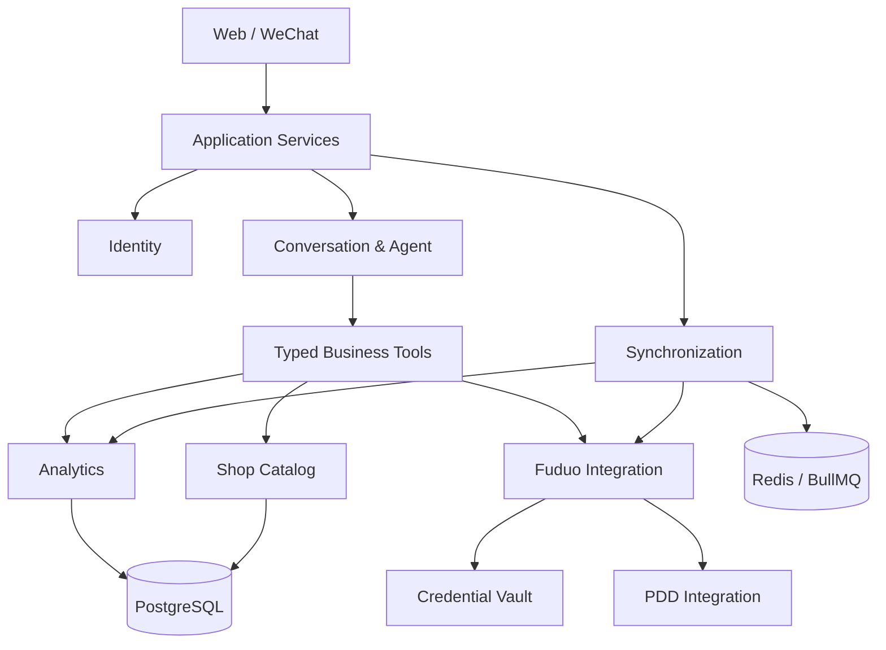
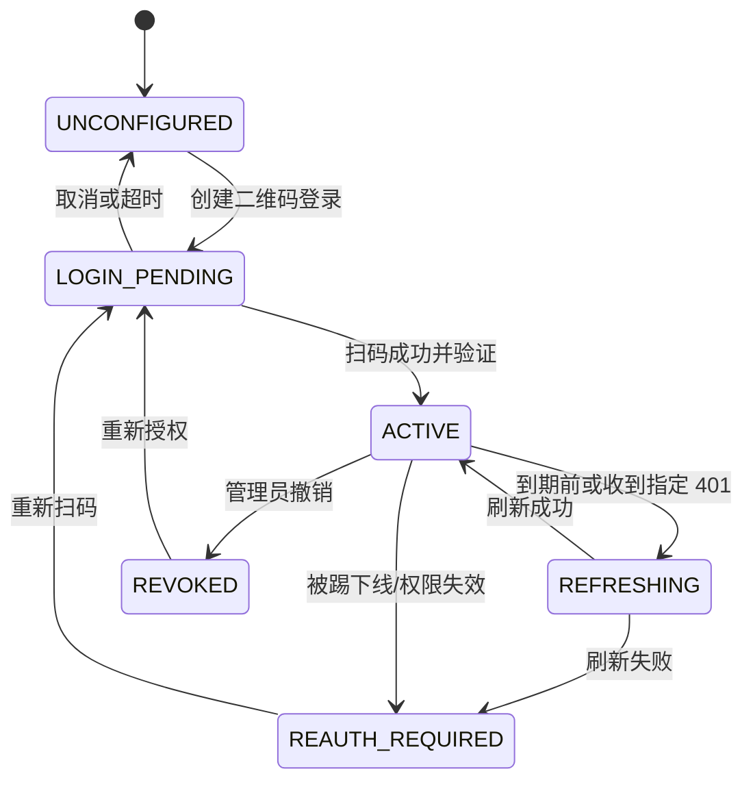
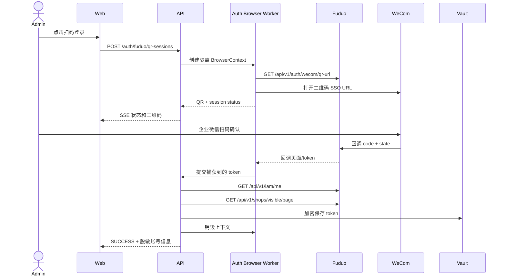
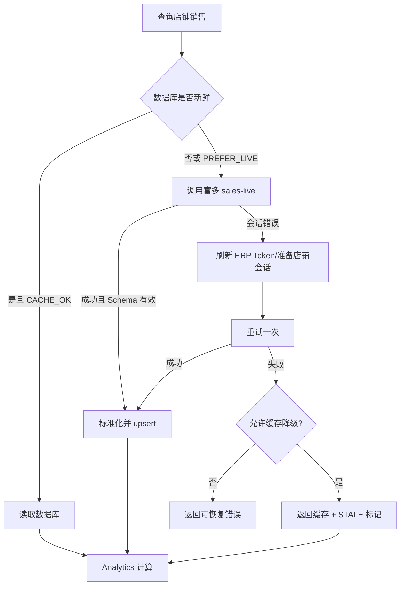

# 富多店铺智能助手：项目设计逻辑 V1.0

## 1. 设计目标

系统面向公司内部员工，通过网站和微信私聊查询富多/拼多多店铺经营数据。设计必须同时满足：

- 云端直接调用富多和拼多多接口；
- 富多 Authorization 可通过网站二维码登录获得并自动刷新；
- 业务查询结果可持久化、追溯和重复计算；
- 大模型只负责任务理解和结果表达，不直接接触凭证或执行任意请求；
- 任何实时查询失败时仍可提供明确标记的历史数据；
- V1 对 1 个富多账号、10 家以内店铺保持简单，同时保留扩展边界。

## 2. 架构原则

### 2.1 模块化单体优先

V1 使用 NestJS 模块化单体加独立 Worker，不在初始规模下拆分大量微服务。

部署进程：

```text
web               Next.js
api               NestJS HTTP/SSE API
worker            BullMQ 同步和报表任务
auth-browser      Playwright 二维码登录 Worker
openclaw          OpenClaw Gateway
postgres          PostgreSQL
redis             Redis
```

业务边界通过 NestJS Module、数据库表和队列事件隔离。未来只有出现独立扩容、故障隔离或团队所有权需求时才拆服务。

### 2.2 确定性业务逻辑

- 金额、排名、同比、环比和报表统计由代码计算。
- Agent 只能调用已注册的结构化工具。
- 工具只返回完成回答所需的数据，不返回原始凭证和无关字段。
- 相同参数、相同数据版本应得到相同统计结果。

### 2.3 外部接口不可信

富多和拼多多响应必须经过运行时 Schema 校验。接口成功 HTTP 状态不等于业务成功，统一检查：

```text
HTTP status
success/code/message
data schema
business status
data freshness
```

## 3. 业务域划分

### 3.1 Identity & Access

职责：

- 内部用户登录；
- TOTP；
- 角色和店铺范围；
- Web、微信身份绑定；
- 会话撤销。

不负责模型选择、富多 Token 或聊天内容。

### 3.2 Credential Vault

职责：

- 富多 Authorization 加密存储；
- JWT 到期解析；
- Token 刷新和原子替换；
- PDD Cookie 短期密文缓存；
- 模型 API Key 加密存储；
- 凭证状态和重新授权通知。

外部模块只能获取受控的 `CredentialHandle`，不能直接查询数据库密文字段。

### 3.3 Auth Browser

职责：

- 创建一次性二维码登录会话；
- 管理隔离 Playwright BrowserContext；
- 采集富多成功回调 Token；
- 登录完成或超时后清理浏览器状态。

该模块不能执行经营查询。

### 3.4 Fuduo Integration

职责：

- 富多 API URL 和 Header 规范；
- 店铺、账号、销售、登录状态接口；
- `merchant-backend-prepare`；
- `proxy-access`；
- Token 失效识别；
- 富多错误码映射。

### 3.5 PDD Integration

职责：

- 拼多多业务接口适配；
- Cookie、UA、代理出口和必要 Header 的一致性；
- 响应 Schema；
- 拼多多会话失效识别。

PDD SDK 不知道用户、报表和 Agent 会话。

### 3.6 Shop Catalog

职责：

- 富多店铺和账号的本地映射；
- `shopId`、`accountId`、平台店铺 ID；
- 店铺启停、显示名称和员工授权范围；
- 店铺登录状态快照。

### 3.7 Analytics

职责：

- 销售、订单和退款标准模型；
- 日指标 upsert；
- 汇总、排名、同比、环比；
- 缺失日期和部分成功处理；
- 金额 Decimal 运算。

### 3.8 Synchronization

职责：

- 定时任务；
- 手动同步；
- 并发和幂等；
- 重试、补偿和数据新鲜度；
- 同步运行记录。

### 3.9 Conversation & Agent

职责：

- 会话和消息；
- 模型路由；
- 工具目录和调用；
- 流式输出；
- 上下文限制；
- 工具审计。

### 3.10 Channels

职责：

- Web Chat 和 OpenClaw 微信消息标准化；
- 微信用户配对；
- 入站去重；
- 出站格式和长度适配；
- 渠道投递状态。

### 3.11 Reports

职责：

- 日报、周报模板；
- 调度规则；
- 数据截止时间；
- 微信和 Web 投递；
- 报表版本和历史。

### 3.12 Audit

职责：

- 登录、授权、模型修改、查询和工具调用审计；
- Trace ID；
- 脱敏参数；
- 保留策略。

## 4. 依赖方向



约束：

- UI 不直接调用外部平台。
- Agent 不直接依赖 Fuduo/PDD SDK，只依赖业务工具。
- Integration 不依赖 UI、对话或报表。
- Credential Vault 不向模型层暴露 Token。

## 5. 核心状态机

### 5.1 富多凭证状态



状态含义：

```text
UNCONFIGURED      从未授权
LOGIN_PENDING     二维码登录进行中
ACTIVE            可正常调用
REFRESHING        只有一个刷新任务运行
REAUTH_REQUIRED   查询停用，历史数据可用
REVOKED           管理员主动撤销
```

### 5.2 二维码登录状态

```text
CREATED
WAITING_SCAN
SCANNED
VERIFYING
SUCCESS
FAILED
EXPIRED
CANCELLED
```

终态只能写入一次。`SUCCESS` 前必须完成 `/api/v1/iam/me` 和店铺列表验证。

### 5.3 同步任务状态

```text
QUEUED -> RUNNING -> SUCCEEDED
                  -> PARTIAL
                  -> RETRY_WAIT -> RUNNING
                  -> FAILED
                  -> CANCELLED
```

`PARTIAL` 表示部分店铺成功，不能把整次任务标记为失败或覆盖成功数据。

### 5.4 对话轮次状态

```text
RECEIVED
AUTHORIZED
PLANNING
TOOL_RUNNING
COMPOSING
COMPLETED
FAILED
CANCELLED
```

客户端断开不自动取消后端工具调用；只有显式“停止”才取消可取消任务。

## 6. 富多二维码登录逻辑



实现约束：

- `login_session.id` 使用不可预测随机值。
- SSE 订阅必须校验管理员会话和资源所有权。
- 只截取二维码元素，不传输完整第三方页面截图。
- 不把回调 URL写入访问日志。
- Worker 崩溃后由 Reaper 清理孤立会话。
- 4 分钟到期后生成新 `state`，不能复用旧二维码。

## 7. Token 刷新逻辑

### 7.1 主动刷新

- JWT `exp - now <= 30 分钟` 时排队刷新。
- Redis 锁：`credential-refresh:{credentialId}`。
- 锁 TTL 30 秒；仅持锁者请求刷新接口。
- 其他请求短暂等待并重新读取凭证版本。
- 新 Token 验证 `sub/uid/iss` 与原账号一致后原子替换。

### 7.2 被动刷新

只在以下条件尝试一次：

```text
HTTP 401
code == BIZ_UNAUTHORIZED
message 表示登录态更新或令牌失效
```

刷新成功后原请求只重放一次，避免无限循环。非幂等请求默认不自动重放。

### 7.3 失败

- 标记 `REAUTH_REQUIRED`；
- 批量同步在并发前只做一次凭证预检；预检失败立即结束，不再逐店调用无效 Token；
- 保留历史数据查询；
- Web 授权状态显示恢复入口，并向仍有效配对的管理员微信私聊发送固定恢复指引；
- 微信告警以 `tokenVersion` 为 Redis 去重键，全部发送成功后 7 天内不重复；无接收人、部分失败或内部服务异常时只保留 10 分钟抑制窗口；
- `ERP_REAUTH_REQUIRED/ERP_TOKEN_MISSING` 作为 BullMQ 不可恢复错误，不消耗后续任务重试次数；
- 不反复调用无效 Token 造成封禁或日志噪声。

## 8. 店铺同步逻辑

### 8.1 店铺发现

```http
GET /api/v1/shops/visible/page?page=1&size=100&enrichMode=FULL
```

V1 店铺少于 10 家，仍实现分页循环，直到：

- 当前页记录数小于 `size`；或
- 已达到响应声明的总页数；或
- 检测到重复页游标并终止。

### 8.2 ID 映射

本地保存：

```text
fuduo_shop_id
fuduo_account_id
platform_shop_id
platform_code
shop_name
login_status
```

禁止把 `shopId` 和 `accountId` 混用：

- `/shops/{shopId}/...` 使用 shop ID；
- `/shop-accounts/{accountId}/...` 使用 account ID。

### 8.3 删除和不可见

接口中消失的店铺先标记 `INACTIVE`，不物理删除历史数据。连续 7 天不可见后停止调度，管理员可手动归档。

## 9. 销售数据获取逻辑

### 9.1 数据源优先级

```text
1. 富多 sales-live / 已聚合业务接口
2. 本地数据库最近成功数据
3. merchant-backend-prepare + 拼多多直连接口
```

具体查询由工具声明 `freshness`：

```text
CACHE_OK        允许使用满足日期条件的数据库数据
PREFER_LIVE     优先实时，失败后返回带标记缓存
REQUIRE_LIVE    实时失败即失败，不返回缓存冒充实时
```

### 9.2 实时销售流程



### 9.3 数据标准化

- 金额转为 Decimal 字符串入库。
- 日期按 `Asia/Shanghai` 解释为业务日。
- 缺失字段保存为 `null`，不转换为 0。
- 保存 `source`、`source_updated_at`、`fetched_at`、`schema_version`。
- 同店铺同业务日使用 upsert，并保留同步运行记录。

### 9.4 订单和退款聚合

订单与退款优先使用富多只读聚合接口：

```http
POST /api/v1/ops/orders/list
POST /api/v1/ops/aftersales/list
```

- 时间窗口使用 `Asia/Shanghai` 自然日并以 ISO Instant 发送。
- 每个店铺独立分页，默认每页 100，最多 500 页；响应页码不一致或超过上限立即失败。
- 订单按返回记录计算订单数、已支付订单数和支付金额；退款按返回记录计算退款笔数和退款金额。
- 金额转换为分后累计，避免浮点累加误差。
- 接口成功但任何参与汇总的金额缺失时，对应金额保存为 `null`，不使用部分金额冒充完整合计。
- `order_daily(shop_id, trade_date)` 和 `refund_daily(shop_id, trade_date)` 使用 upsert，重复任务不产生重复数据。
- 单店失败不覆盖该店已有数据，其他店铺继续执行，整次运行标记为 `PARTIAL`。

## 10. 拼多多会话逻辑

只有富多聚合接口不能满足需求时才准备 PDD 会话：

1. 使用 `accountId` 调用 `merchant-backend-prepare`。
2. 检查 `action == READY`。
3. 读取 Cookie/CookieSnapshot、UA、sesId。
4. 必要时调用 `proxy-access` 获取固定出口。
5. 以店铺为粒度缓存会话，设置短 TTL。
6. PDD 接口返回会话错误时只重新准备一次。
7. 原始 Cookie 不入业务表、不进 Agent、不进审计参数。

云服务器直接出口是否可用必须在 P0 实测；若 Cookie 与代理/设备绑定，所有该店铺 PDD 请求通过匹配的代理连接池发送。

## 11. 数据同步与调度

### 11.1 队列

```text
shop-catalog-sync
sales-live-sync
sales-reconcile
orders-sync
refunds-sync
report-generate
channel-delivery
credential-refresh
```

### 11.2 幂等键

```text
shop-sync:{credentialId}:{yyyyMMddHHmm}
sales:{shopId}:{tradeDate}:{window}
orders:{shopId}:{tradeDate}
refunds:{shopId}:{tradeDate}
report:{scheduleId}:{periodStart}:{periodEnd}
channel:{channel}:{externalMessageId}
```

### 11.3 并发

- 单个富多账号默认并发 3。
- 单个店铺同数据类型同日期只允许一个运行任务。Worker 使用 Redis `SET NX PX` 租约锁，锁键包含数据类型、富多店铺 ID 和业务日期；随机所有权令牌通过 Lua 原子续租和释放，进程崩溃后由 TTL 自动回收。
- HTTP GET 及明确声明为只读幂等的订单、售后 POST 查询，对 429、5xx 和网络错误采用带抖动指数退避；会话刷新、登录和会话准备 POST 不自动重放。
- 网页手动任务、核心定时同步和定时报表统一配置最多 3 次 BullMQ 尝试与指数退避；HTTP 重试耗尽后才进入任务级重试。
- 店铺级结果存在失败项且仍有 BullMQ 尝试次数时，同一 `SyncRun` 进入 `RETRY_WAIT`；下一次开始时清理旧结束时间和错误。最后一次不再抛出补偿信号，保留实际 `PARTIAL` 或 `FAILED` 统计。
- 定时任务首次执行创建 `SyncRun` 后，必须把 ID 持久化回 BullMQ job data；同一 job 的全部重试复用该记录，禁止每次尝试新建运行记录。ID 持久化失败时立即把新记录标为 `FAILED`。
- 不因单店失败阻塞其他店铺。

### 11.4 校正

当天数据是可变快照，定时覆盖；历史业务日每日统一校正最近 7 天的销售、订单和退款。校正按北京时间日期从近到远执行，每个日期内依次同步三类数据，沿用单类同步的店铺级隔离和 upsert 规则。所有日期和数据类型的 `total/success/failed` 累计后只结算一次 `SyncRun`：无失败为 `SUCCEEDED`，有成功也有失败为 `PARTIAL`，无成功且有失败为 `FAILED`。超过 7 天只在管理员手动补数或发现数据版本变化时更新。

## 12. 数据新鲜度逻辑

统一计算：

```text
LIVE       最后成功获取 <= 10 分钟
RECENT     10 分钟 < 最后成功获取 <= 60 分钟
STALE      > 60 分钟或最近实时同步失败
UNKNOWN    从未成功
```

返回数据时同时携带：

```json
{
  "freshness": "LIVE",
  "dataAsOf": "2026-07-21T08:30:00Z",
  "lastAttemptAt": "2026-07-21T08:31:00Z",
  "source": "FUDUO_SALES_LIVE",
  "partial": false
}
```

Agent 回答和报表必须读取该元数据，不允许自行描述“实时”。

## 13. Agent 设计逻辑

### 13.1 处理管线


### 13.2 工具选择

V1 工具全部只读。模型只能看到：

- 工具名称和用途；
- 明确的输入 Schema；
- 脱敏业务结果；
- 数据新鲜度。

模型看不到：

- 任意 HTTP 工具；
- Shell、SQL、文件系统；
- Authorization、Cookie、代理账号；
- Integration 原始异常堆栈。

### 13.3 消歧

下列情况先向用户澄清，不猜测：

- 店铺名称匹配多个店铺；
- “最近”没有系统默认可接受的时间范围；
- 用户要求的指标尚未接入；
- 请求跨越当前用户无权限的店铺。

默认规则可以确定的参数不询问：

- “昨天”按北京时间自然日；
- “本月”从当月 1 日到当前业务日；
- “所有店铺”指当前用户有权查看的启用店铺。

### 13.4 计算

- 汇总在 Analytics 层完成。
- 环比基期长度与当前期相同。
- 同比使用上一自然年相同日期范围。
- 分母为 0 时比例为 `null`，回答显示“无法计算”。
- 部分店铺失败时返回成功店铺合计，并明确缺失名单。

### 13.5 模型路由

```text
简单查询/格式化        default_chat_model
复杂多步分析           analysis_model
主模型超时或限流       fallback_model
```

模型降级最多一次。工具调用结果不因模型切换而重新执行，避免重复请求和费用。

## 14. 微信渠道逻辑

### 14.1 入站

1. OpenClaw 微信插件接收私聊。
2. 使用外部消息 ID 去重。
3. 检查 pairing 和内部用户绑定。
4. 把微信用户映射为系统用户和权限。
5. 创建/恢复 `per-account-channel-peer` 会话。
6. 将标准化消息提交 Conversation Service。

### 14.2 出站

- 短答案直接发文本。
- 多店铺结果采用紧凑列表，必要时分段。
- 长报表发送摘要和 Web 详情链接。
- 每条经营数据回答末尾显示数据截止时间。
- 工具失败时不发送内部错误堆栈，只发送可恢复动作和 Trace ID。

### 14.3 权限撤销

撤销 pairing 后：

- 新消息立即拒绝；
- 已运行的只读查询可以完成但不发送结果；
- 后台会话标记为 revoked；
- 写入审计事件。

## 15. 报表逻辑

### 15.1 报表生成

1. 根据调度时区确定统计范围。
2. 检查数据新鲜度。
3. 缺失数据触发一次补同步并等待有限时间。
4. 使用 Analytics 生成结构化报表数据。
5. 渲染 Web 版和微信版。
6. 保存报表快照和数据截止时间。
7. 投递并记录每个渠道结果。

报表生成后不随数据库数据变化而改变；重新生成会创建新版本。

### 15.2 日报内容

```text
总销售额
订单量
付款人数
客单价
退款金额/退款率
店铺排名
环比变化
异常和缺失店铺
数据截止时间
```

## 16. 内部 API 设计

### 16.1 Web API

```http
POST   /api/auth/login
POST   /api/auth/totp/verify
POST   /api/auth/logout

POST   /api/fuduo/qr-sessions
GET    /api/fuduo/qr-sessions/{id}
GET    /api/fuduo/qr-sessions/{id}/events
DELETE /api/fuduo/qr-sessions/{id}
GET    /api/fuduo/credential/status
POST   /api/fuduo/credential/refresh
DELETE /api/fuduo/credential

GET    /api/shops
GET    /api/shops/{id}
GET    /api/shops/{id}/sales
GET    /api/analytics/summary
GET    /api/analytics/rankings

POST   /api/sync/runs
GET    /api/sync/runs
GET    /api/sync/runs/{id}

POST   /api/chat/turns
GET    /api/chat/turns/{id}/events
POST   /api/chat/turns/{id}/cancel

GET    /api/reports
POST   /api/report-schedules
PATCH  /api/report-schedules/{id}

GET    /api/model-providers
POST   /api/model-providers
POST   /api/model-providers/{id}/test

POST   /api/internal/alerts/erp-reauth
```

### 16.2 响应包络

```json
{
  "success": true,
  "data": {},
  "meta": {
    "traceId": "...",
    "dataAsOf": "...",
    "freshness": "LIVE"
  }
}
```

错误：

```json
{
  "success": false,
  "error": {
    "code": "ERP_REAUTH_REQUIRED",
    "message": "富多授权已失效",
    "recovery": "请在设置中重新扫码授权"
  },
  "meta": {
    "traceId": "..."
  }
}
```

## 17. 错误分类

```text
AUTH_*          系统用户认证
ERP_*           富多 Authorization 和业务接口
SHOP_SESSION_*  店铺/PDD 会话
SYNC_*          同步和队列
DATA_*          Schema、缺失、过期
MODEL_*         模型供应商
CHANNEL_*       微信/OpenClaw
SYSTEM_*        数据库、Redis、未知错误
```

错误必须声明：

- 是否可重试；
- 是否需要重新授权；
- 是否可以返回缓存；
- 用户可见文案；
- 日志级别。

## 18. 数据库逻辑约束

- 所有主键使用 UUID/ULID；外部平台 ID 单独字段存储。
- 金额使用 `numeric(20, 2)` 或更高精度。
- 所有业务日字段使用 `date`；事件时间使用 `timestamptz`。
- 软删除用于用户、店铺、模型和调度配置。
- 凭证密文字段与业务字段分表。
- 审计日志追加写，不支持普通用户修改。
- JSONB 只用于外部扩展字段和脱敏快照，核心可查询字段必须结构化。

## 19. 缓存逻辑

Redis 仅缓存：

- 分布式锁；
- BullMQ 数据；
- 短期 PDD 会话密文；
- 频繁读取的店铺列表；
- 二维码会话状态；
- 幂等消息键。

PostgreSQL 是业务事实来源。Redis 丢失后系统可以从数据库和外部接口恢复，不能导致历史销售数据丢失。

## 20. 可观测性

### 20.1 Trace

一次用户请求在以下组件共享 Trace ID：

```text
Web/WeChat -> OpenClaw/API -> Tool -> Fuduo/PDD -> DB -> Response
```

### 20.2 指标

```text
external_api_latency_seconds
external_api_errors_total
credential_refresh_total
sync_job_duration_seconds
sync_job_failures_total
data_freshness_age_seconds
agent_turn_duration_seconds
tool_call_duration_seconds
model_tokens_total
channel_delivery_failures_total
```

### 20.3 日志

- JSON 结构化日志；
- Authorization/Cookie/Set-Cookie/API Key 全局 Redactor；
- 请求正文默认不记录；
- 外部错误正文只保留经过允许列表处理的字段；
- 生产日志不使用 Debug 级别输出第三方响应。

## 21. 测试策略

### 21.1 单元测试

- JWT 到期和刷新决策；
- 金额汇总、同比、环比和排名；
- 新鲜度计算；
- 错误分类；
- 店铺名称消歧；
- Agent 工具参数 Schema。

### 21.2 契约测试

- 富多店铺列表；
- session refresh；
- merchant-backend-prepare；
- sales-live；
- 后续 PDD API。

真实响应必须脱敏后保存为 Fixture。

### 21.3 集成测试

- PostgreSQL + Redis + BullMQ；
- 同步幂等和并发锁；
- Token 原子替换；
- 部分店铺失败；
- 报表生成和渠道投递。

### 21.4 E2E

- 管理员登录；
- 富多二维码登录；
- 店铺同步；
- Dashboard 查询；
- Web Chat 工具调用；
- 模型切换；
- 微信 pairing；
- 授权失效和重新授权。

## 22. V1 边界

V1 包含：

- 云端二维码授权；
- Token 自动刷新；
- 店铺目录；
- 销售核心指标和历史；
- Web Dashboard；
- Web Chat；
- OpenClaw 微信私聊；
- 多模型切换；
- 日报、周报；
- 同步和审计。

V1 不包含：

- 微信群聊；
- 发货、改价、广告调整等写操作；
- 对外 SaaS 注册和计费；
- 多租户；
- 移动原生 App；
- 大规模数据仓库；
- 自动执行未经确认的经营操作。

## 23. 开发顺序

```text
1. 外部 API 契约与二维码登录原型
2. Credential Vault 和 Token 刷新
3. 店铺目录与销售同步
4. Analytics 和数据库
5. Dashboard
6. Agent Tools 和 Web Chat
7. 微信私聊
8. 报表
9. 安全、监控和部署
```

前一阶段的验收测试通过后才进入下一阶段，尤其不能在二维码登录、Token 刷新和数据口径尚未验证前开始堆叠大量 UI。
